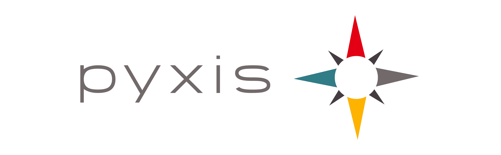

# CIELUM

CIELUM is an ecosystem of products that has a clear objective: provide key actors with a reliable, highly-dependable UTM solution for airspace management of Unmanned Aerial Vehicles, also knowns as RPAs or simply drones.

## Project manager

CIELUM is developed and maintained by Dronfies Labs SAS

## Last revision date

16/03/2023

## Project purpose

We aim to make airspace as open as possible to unmanned aircraft

## Project objectives

We aim to develop an “easy to deploy” UTM solution for supporting humanitarian drone operations around the world.

We aim to create a community of UTM suppliers that contributes with different pieces of the UTM ecosystem to make UTM/Space development cheaper
We aim to integrate different drone manufacturers with our remote Identification API.

## Project scope

All related to Unmanned Traffic Management are inside the scope, but nothing else. Features like flight management, and tracking hardware, are explicitly out of the scope.
Stakeholders and approvers
A member of Dronfies Labs is designated as CIELUM project manager, and will approve everything related to the project.

## Project Sponsors

## Contact
info@dronfies.com